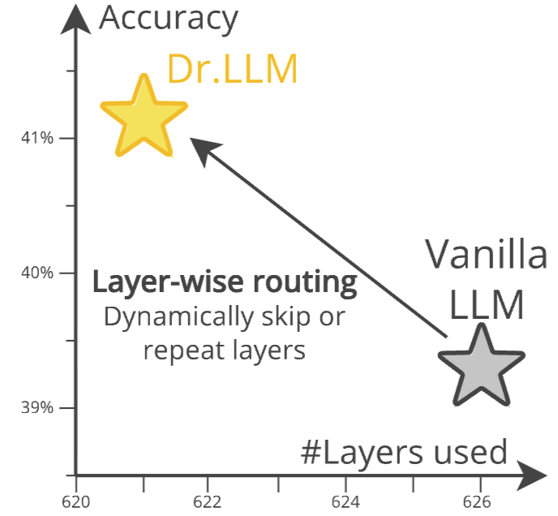
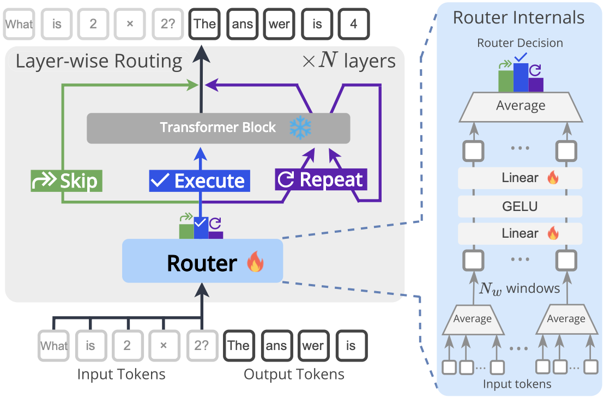
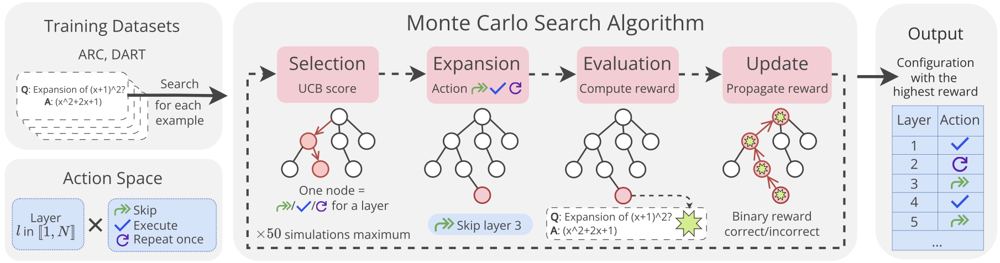

<div align="center">

# 🧩 Dr.LLM: Dynamic Layer Routing in LLMs

[](https://arxiv.org/pdf/2510.12773)</br>
<a href="https://www.linkedin.com/in/ahmed-heakl/"><b>Ahmed Heakl</b></a>, <a href="https://scholar.google.com/citations?user=Jt4OYwMAAAAJ&hl=fr"><b>Martin Gubri</b></a>, <a href="https://scholar.google.com/citations?user=M59O9lkAAAAJ&hl=en"><b>Salman Khan</b></a>, <a href="https://scholar.google.com/citations?user=o0qtjzYAAAAJ&hl=en"><b>Sangdoo Yun</b></a>, <a href="https://seongjoonoh.com/"><b>Seong Joon Oh</b></a></br>
Parameter Lab · MBZUAI · NAVER AI Lab · University of Tübingen · Tübingen AI Center


---

<div align="center" style="border: 2px solid #FF6B6B; background-color:#fff5f5; border-radius:10px; padding:16px;">

<h3>🚨 <b>CODE RELEASE STATUS</b></h3>

🧩 The <b>training</b>, <b>data generation</b>, and <b>in-domain evaluation</b> code for <b>Dr.LLM</b> are <b>not yet released</b>.<br>
These components (<b>MCTS supervision</b>, <b>router training scripts</b>, and <b>lm-eval integration</b>) will be made public in an upcoming update.<br><br>
<b>Stay tuned for the full release!</b>

</div>


</div>


## 🆕 Latest Updates
- 📢 **15 October 2025**: Paper ArXived!

## 📘 Table of Contents
- [Overview](#overview)
- [🧪 Evaluation](#-evaluation)
  - [In-Domain (Training & Evaluation Tasks)](#in-domain-training--evaluation-tasks)
  - [Out-of-Domain (Generalization Benchmarks)](#out-of-domain-generalization-benchmarks)
- [📊 Results Summary](#-results-summary)
- [⚙️ Usage](#️-usage)
  - [Installation](#1️⃣-installation)
  - [Training the Routers](#2️⃣-training-the-routers)
  - [Evaluation with lm-eval-harness](#3️⃣-evaluation-with-lm-eval-harness)
- [🧭 Citation](#-citation)


## 🧩 Overview

<p align="center">
  
</p>

Large Language Models (LLMs) process every token through all layers of a transformer stack, wasting compute on simple queries and lacking flexibility for harder ones that need deeper reasoning.  

**Dr.LLM (Dynamic Routing of Layers for LLMs)** is a retrofittable framework that adds lightweight per-layer routers to pretrained models.  
Each router decides whether to skip, execute, or repeat a layer, enabling adaptive depth without retraining or architectural changes.

Routers are trained with explicit supervision from Monte Carlo Tree Search (MCTS), generating high-quality layer configurations that preserve or improve accuracy under a compute budget.  
Stabilized with windowed pooling, focal loss, and bottleneck MLPs, Dr.LLM maintains robustness under class imbalance and long sequences.

📈 **Results**
- On ARC (logic) and DART (math), Dr.LLM improves accuracy by **+3.4%p** while saving **~5 layers** per input.
- Routers generalize to MMLU, GSM8k, AIME, TruthfulQA, SQuADv2, GPQA, PIQA, and AGIEval with only **0.85% accuracy drop**.
- Outperforms prior routing methods (LayerSkip, FlexiDepth, MindSkip) by up to **+7.7%p**.

> 💡 Dr.LLM equips frozen LLMs for **budget-aware**, **accuracy-driven inference** — no base weight modification required.

### Routers
<p align="center">
  
</p>

> Our layer routing based on hidden states. Dr.LLM augments a frozen decoder-only LLM with per-layer routers that decide to skip, execute, or repeat a block once. Routers read windowed summaries of hidden states
and are trained from MCTS-derived targets. 

### Training with MCTS Supervision
<p align="center">
  
</p>

> Length-aware MCTS used to collect the supervised training dataset of per-layer routing
configurations (skip/execute/repeat). For each input, MCTS explores modified layer paths
and retains accuracy-preserving or improving ones under a compute budget.

## 🧪 Evaluation

We evaluate **Dr.LLM** using [`lm-eval-harness`](https://github.com/EleutherAI/lm-evaluation-harness) across both **in-domain reasoning tasks** and **out-of-domain (OOD)** benchmarks.

### In-Domain (Training & Evaluation Tasks)

| Dataset                | Domain          | Metric   | Purpose                              |
| ---------------------- | --------------- | -------- | ------------------------------------ |
| **ARC-Easy/Challenge** | Logic reasoning | Accuracy | Test structured reasoning depth      |
| **DART (levels 1–5)**  | Math reasoning  | Accuracy | Test iterative, multi-step reasoning |

Dr.LLM routers are trained on 4K MCTS-derived execution paths from these datasets.


During inference, layer routing decisions are applied *per input sequence*, adding negligible overhead and remaining KV-cache compatible.

---

### Out-of-Domain (Generalization Benchmarks)

We evaluate zero-shot transfer on:

> **MMLU**, **GSM8k**, **AIME24**, **TruthfulQA**, **GPQA Diamond**, **SQuADv2**, **PIQA**, and **AGIEval**.

Dr.LLM achieves **only −0.85%p average accuracy drop** while maintaining efficiency across these unseen datasets — showing strong generalization.

---

## 📊 Results Summary

| Model             | Domain   | Δ Accuracy | Layers Saved |
| ----------------- | -------- | ---------- | ------------ |
| LLaMA-3B-Instruct | ARC+DART | **+2.7%p** | −7.4         |
| LLaMA-8B-Instruct | ARC+DART | **+2.3%p** | −8.7         |
| LLaMA-3B-Base     | ARC+DART | **+3.2%p** | −3.0         |
| LLaMA-8B-Base     | ARC+DART | **+2.4%p** | −4.2         |
| Qwen-3B-Instruct  | ARC+DART | **+2.3%p** | −3.3         |
| Qwen-7B-Instruct  | ARC+DART | **+0.9%p** | −3.4         |

> 🧠 Routers improve reasoning-heavy tasks by **up to +4.0%p accuracy** while skipping **5 layers per example** on average.

Compared to prior adaptive-depth methods (e.g., LayerSkip, FlexiDepth, MindSkip), **Dr.LLM**:

* Trains on only **4K MCTS paths** (vs 300K+ examples),
* Requires **no finetuning or base weight modification**,
* Outperforms SoTA methods by up to **+7.7%p accuracy**.

---

## ⚙️ Usage

### 1️⃣ Installation

```bash
git clone https://github.com/parameterlab/dr-llm
cd dr-llm
pip install -r requirements.txt
```

<details>
<summary><b>2️⃣ Training the Routers </b></summary>

> ⚠️ Note: Full code release is pending ⚠️

Training uses **AdamW**, 25 epochs, **1×10⁻³ LR**, **bf16 precision**, and a **single A100 GPU (40GB)** — taking under 4 hours.


Models source code must be manipulated to insert routers after each transformer block. 

Routers are trained separately using MCTS-generated supervision:

```bash
python train.py \
  --model llama-3-8b-instruct \
  --data_dir data/arc_dart \
  --save_dir checkpoints/drllm_router
```
</details>

<details>
<summary><b>3️⃣ Evaluation with lm-eval-harness</b></summary>

> 🚨 Note: Full code release is pending 🚨

```bash
lm_eval \
  --model openai/llama-3-8b-instruct \
  --tasks arc_challenge,dart,gsm8k,mmlu \
  --device cuda
```
</details>


---


## 🧭 Citation

If you find this work useful, please cite:

```bibtex
@article{heakl2025drllm,
  title={Dr.LLM: Dynamic Layer Routing in LLMs},
  author={Ahmed Heakl and Martin Gubri and Salman Khan and Sangdoo Yun and Seong Joon Oh},
  journal={arXiv preprint arXiv:2510.12773},
  year={2025}
}
```

